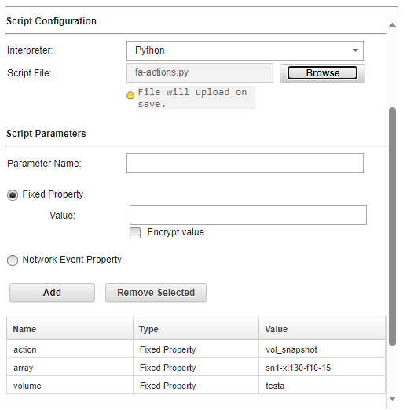
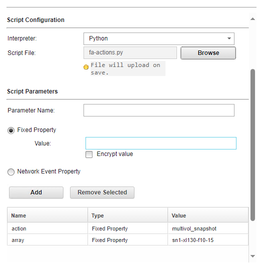
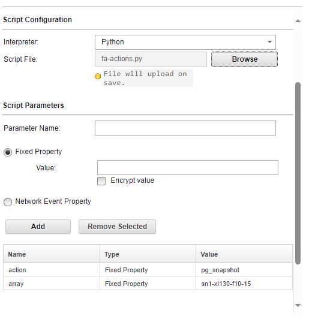
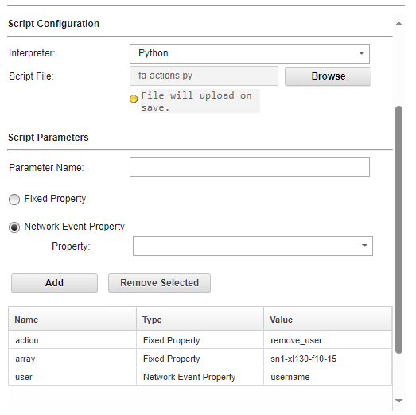

# QRadar-Security-Solutions


## Introduction

With IBM QRadar, administrators can invoke a custom script and pass data to a script that is
based on a rule response.

This document describes a sample custom action script for Pure Storage FlashArray which can be used with QRadar. It provides details on the script's available action, inputs required for the script to run, and the configuration file to be created.

## Create the Configuration File
The configuration file needs to be created under “/opt/qradar/bin/ca_jail/pure.conf” with the following parameters on the QRadar SIEM server:

Click [here](https://support.purestorage.com/FlashArray/PurityFA/FlashArray_Admin_and_CLI_Reference_Guides) and refer to the section Creating API Tokens for details on how to create an api_token.  

Config file has only one entry per FlashArray.
To incorporate new Volumes or Protection Groups, you can perform an in-place edit on the corresponding array line within the file. 
The plugins will automatically detect these changes for subsequent executions. When adding a new array and you must users should append a new line to the file. as illustrated below, and provide the required details accordingly.                 The following table illustrates an example for the variables in the file: 

| Name                  | Type        | Description                                 | Required |
| --------------------- | ----------- | ------------------------------------------- | -------- |
| Array controller name | String      | Name of the FlashArray                      | Yes      |
| API Token             | String      | API token access the array                  | Yes      |
| volume list           | List        | List of volumes to create snapshot          | Yes      |
| Protection group list | List        | List of protection group to create snapshot | Yes      |


Sample configuration file

```
pure-array-1:xxxxx-fffff-xccccc-ccceeee:aa_test_vol,testvol1:ps_1,pg_2
pure-array-2:xxxxx-fffff-xccccc-ccceeee:test_vol,pp_vol:pg_3,pgroup-auto
```

## Configuring custom action script on QRadar

The custom script must be uploaded into IBM QRadar by using the Define Actions icon in
the Admin tab of the IBM QRadar GUI. Download and save the python script to the same location on the local drive that is used to access IBM QRadar 


### Creating a custom action script
This section explains how to create custom action scripts that can be associated with QRadar events. You have to complete the following steps:

1. Download the python script.
2. In the IBM QRadar GUI, open the **Admin settings** tab.
3. Click the navigation menu, and then click **Admin** to open the **Admin** tab.
4. Under **Custom Actions**, click **Define Actions**.
5. To upload your scripts, click **Add**.
6. Under **Basic Information**, type a name for the custom action.
7. Scroll down to **Script configuration** and select **Interpreter: Bash, python, perl**.
8. Click **Browse** and find the file that you created in step 1.
9. Scroll down and click **Save** to save the changes made and select **Deploy Changes**. 


### Script configuration for different actions

Scripts parameters can be fixed property or network event property which is extacted from the event. 

The python script supports following actions. 

1. Create single volume snapshot (action = vol_snapshot )



2. Create multiple volume snapshot action = multivol_snapshot).



3. Create a protection group snapshot (action = pg_snapshot).



4. Remove a user (action = remove_user). 



### Testing the custom action script

To test the script by using the Test Execution


1. In the IBM QRadar GUI, open the **Admin settings** tab
2. Click the navigation menu and then click **Admin** to open the Admin tab.
2. Scroll down to **Custom Actions**.
3. Click **Define Actions**.
4. Highlight the test script.
5. Click **Test Execution → Execute**.